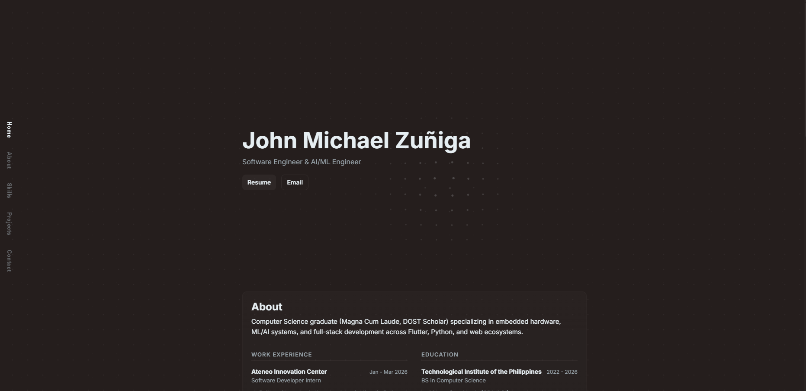
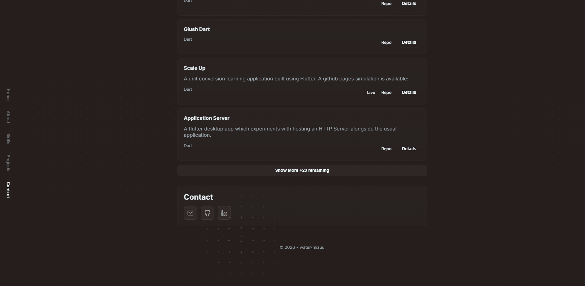

<!-- rank: 3 -->
<!-- name: Portfolio Website -->

I wanted a modern, fast, and automated way to showcase my software engineering work without the overhead of manually updating a CMS or copying-and-pasting details every time I update a project.
This portfolio acts as a static React application that automatically fetches, filters, and parses live data directly from my GitHub repositories at build time.

### Tech Stack & Key Features

- **Frontend Stack**: Built with React 19, TypeScript, and Vite for fast development and optimized production builds.
- **Custom Styling**: Utilizes scoped CSS Modules to ensure styling integrity without the bloat of large framework dependencies.
- **Build-time Automation**: Uses a custom Node.js script (`fetch-github-data.js`) with the GitHub API to query repository structures, parse readme files, and extract custom portfolio metadata.
- **Opt-in**: A custom opt-in mechanism that scans for a `PORTFOLIO.md` file and uses a hidden comment to determine order, allowing me to easily highlight my best work.

### What I Learned

- **ReactJS and Vite**: Previously I only used React with NextJS, so seeing how a Vite project works is a point of learning for me.
- **Automated Workflows**: Integrating API requests directly into the build pipeline simplifies deployment and ensures content never goes out-of-date.
- **Rate-Limit Management**: Solved GitHub API rate-limiting constraints for builds by integrating secure authentication tokens (`GITHUB_TOKEN`) and batching requests.
